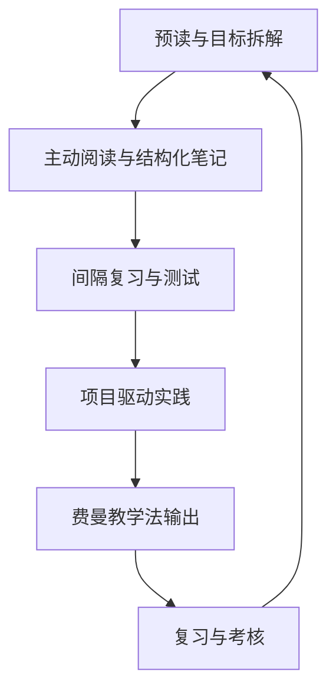

### **Agent算法专家深度学习方法定制**  
**核心原则**：以**输出驱动输入**，通过**预读→结构化笔记→间隔复习→项目实战→教学输出**闭环，最大化知识留存与实战能力。  
**工具链**：安卓电纸书（深度阅读+手写批注）、Obsidian（知识管理）、Anki（间隔复习）、GitHub（项目托管）。  


### **一、学习流程总图**  


---

### **二、分步详解与工具操作**  
#### **1. 预读与目标拆解**  
**目标**：5分钟内定位核心问题，明确学习方向。  
**工具**：安卓电纸书 + Obsidian  
**步骤**：  
1. **快速扫描**：用安卓电纸书阅读材料标题、目录、图表，高亮关键词（如“责任链模式”“向量检索”）。  
2. **记录问题**：在Obsidian中新建笔记，按模板填写：  
   ```markdown  
   ## {{文档标题}}  
   ### 预读问题  
   - Q1: Chain模块如何实现流程控制？  
   - Q2: 责任链模式在源码中如何体现？  
   ### 预期输出  
   - 绘制Chain流程图  
   - 写一段Chain调用代码  
   ```  
3. **同步电纸书**：将笔记导出为PDF，同步到电纸书离线阅读。  

---

#### **2. 主动阅读与结构化笔记**  
**目标**：构建知识关系图，形成长期记忆锚点。  
**工具**：安卓电纸书（手写批注） + Obsidian（Excalidraw/Mermaid）  
**步骤**：  
1. **分块阅读**：  
   - 每读一段，暂停并自问：“这段回答了哪个预读问题？”  
   - 在电纸书上手写批注（如“此处是责任链模式的关键实现”）。  
2. **制作关系图**：  
   - 用Excalidraw绘制模块关系图（例：`Chain → Tools → API调用`）。  
   - 在Obsidian中嵌入关系图，并双向链接相关概念（`[[责任链模式]]`）。  
3. **代码即笔记**：  
   - 在Obsidian中直接嵌入代码片段，并注释关键逻辑：  
   ```python  
   # Langchain Chain示例  
   from langchain.chains import LLMChain  
   chain = LLMChain(llm=llm, prompt=prompt) # 责任链模式解耦处理器  
   ```  

---

#### **3. 间隔复习与测试**  
**目标**：利用间隔重复对抗遗忘，强化长期记忆。  
**工具**：Anki + 安卓电纸书（手写复习）  
**步骤**：  
1. **生成测试卡**：  
   - 将笔记中的核心概念转为Anki问答卡：  
     - 正面：`Chain的责任链模式如何提升灵活性？`  
     - 背面：`通过解耦处理器，允许动态组合流程，例如__场景。`  
2. **电纸书复习**：  
   - 每日用AnkiDroid复习卡片，答错的题目手写补充推导过程。  
   - 将手写内容OCR后同步到Obsidian，链接到原笔记。  
3. **每周复盘**：  
   - 用Obsidian Dataview插件汇总所有`#待解决`标签，集中攻克。  

---

#### **4. 项目驱动实践**  
**目标**：通过微项目验证知识，积累实战经验。  
**工具**：GitHub + 安卓电纸书（架构草图）  
**步骤**：  
1. **项目设计**：  
   - 用安卓电纸书手绘系统架构图（如Multi-Agent协作流程）。  
   - 拍照导入Obsidian，作为项目文档的初始设计。  
2. **代码开发**：  
   - 按周计划实现功能（如第1周：用Chain实现敏感词过滤→翻译→摘要流水线）。  
   - 代码提交至GitHub，README中附架构图链接。  
3. **性能优化**：  
   - 使用电纸书记录性能瓶颈（如“API调用延迟高”），同步到Obsidian的`#优化日志`。  

---

#### **5. 费曼教学法输出**  
**目标**：通过教学暴露知识盲区，巩固理解。  
**工具**：安卓电纸书（录制草稿） + B站/Medium  
**步骤**：  
1. **模拟教学**：  
   - 在电纸书上列出讲解大纲（如“Langchain Chain的三大设计原则”）。  
2. **录制视频**：  
   - 用手机或Loom录制10分钟讲解视频，强调卡壳点（如“动态组合流程的具体实现”）。  
3. **发布内容**：  
   - 将视频上传B站，技术博客发布到Medium/掘金，附GitHub项目链接。  

---

#### **6. 复习与考核**  
**目标**：周期性检验学习效果，动态调整计划。  
**工具**：Obsidian + Kaggle  
**步骤**：  
1. **每周考核**：  
   - 周六完成代码项目，提交至GitHub，撰写实验报告（含性能指标与优化方案）。  
2. **每月挑战**：  
   - 参与Kaggle竞赛（如LLM Prompt比赛），目标排名前20%。  
   - 在电纸书上手写竞赛思路，同步到Obsidian复盘。  

---

### **三、安卓电纸书的高效整合**  
| **场景**               | **电纸书使用**                              | **工具联动**                              |  
|------------------------|--------------------------------------------|------------------------------------------|  
| **深度阅读**           | 离线阅读PDF/论文，手写批注与高亮            | 同步批注到Obsidian，生成关系图            |  
| **架构设计**           | 手绘系统流程图、类图                        | 拍照导入Obsidian，链接到项目文档          |  
| **复习测试**           | 查看Anki卡片，手写错题解析                  | OCR后同步到Obsidian，更新知识库           |  
| **灵感记录**           | 随时记录技术灵感（如优化点子、新框架思路）  | 定期整理到Obsidian的`#灵感池`标签         |  

---

### **四、学习效果检验标准**  
1. **短期（1个月）**：  
   - 能脱离笔记复现核心技术的流程图/代码（如手写Chain执行逻辑）。  
   - Anki测试正确率≥80%。  
2. **中期（3个月）**：  
   - 独立开发一个Multi-Agent系统（如电商客服中台），文档完整。  
   - GitHub项目Star≥50，技术博客阅读量≥2000。  
3. **长期（6个月）**：  
   - 成为Langchain/LlamaIndex核心贡献者（合并≥5个PR）。  
   - Kaggle竞赛进入前10%，或发表顶会论文。  

---

通过这套方法，你将从“被动输入”升级为“主动构建者”，知识留存率提升3倍以上，同时积累可展示的实战成果，为求职或技术突破打下坚实基础！